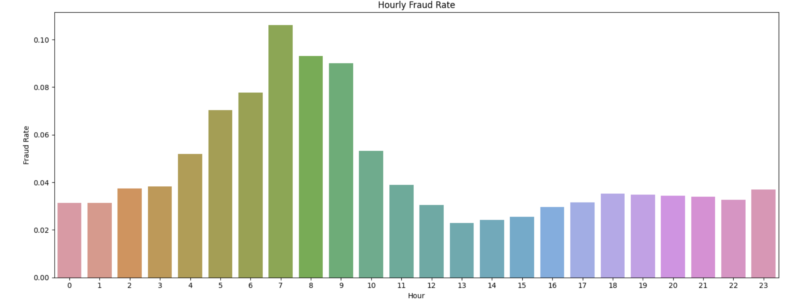
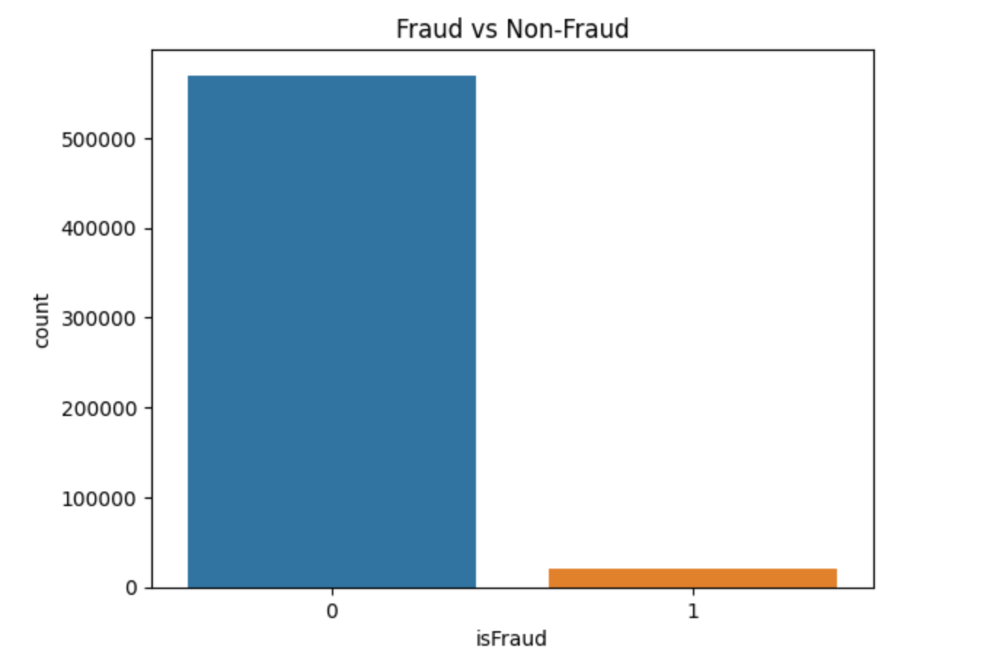
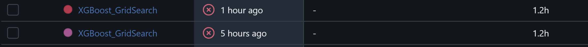
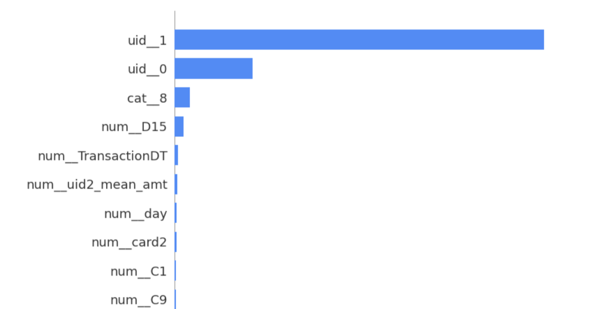

# IEEE-CIS Fraud Detection პროექტი

## კონკურსის მოკლე მიმოხილვა
Kaggle-ზე Fraud Detection პრობლემა, რომლის ამოცანაა fraud ტრანზაქციების იდენტიფიცირება.

## ჩვენი მიდგომა
მონაცემთა გაწმენდა, მახასიათებლების ინჟინერია, მოდელის შერჩევა და შედეგების შეფასება MLflow-ის მეშვეობით.

## რეპოზიტორიის სტრუქტურა
- model_experiment_*.ipynb - თითოეული მოდელის ექსპერიმენტები
- model_inference.ipynb - საბოლოო პროგნოზირება
- pipeline/ - შენახული საუკეთესო pipeline-ები
- README.md - ეს ფაილი

## Feature Engineering
- გადავარჩიe >= 90% NaN მნიშვნელობების მქონე სვეტები
- Email Domain-ების გაწმენდა
- TransactionAmt → Log
- Timestamp features, კერძოდ **TransactionDT** გავხსენით დროის ფუნქციებად:
   - **დღე** (`Transaction_day`)
   - **საათი** (`Transaction_hour`)
   - **კვირის დღე** (`Transaction_weekday`)
   ამ ახალი feature-ების გამოყვანა საბოლოო ჯამში ვფიქრობ კარგი გადაწყვეტილება იყო, რადგან  **weekly** (კვირების მიხედვით) და **hourly** (საათების მიხედვით) isFraud განაწილების გრაფიკები, რომ ვნახოთ თაღლითობა სად იჩენს თავს, საინტერესომ იყო საათის მიხედვით isFraud განაწილება:

- **Freq-Encoding**: ყველა ფუნქციისთვის ვიღებთ სიხშირის კოდირებას.
- Woe encoding


## Imbalance Treatment
საკმაოდ დიდი პროცენტული განსხავება იყო fraud vs non-fraud ტრანზაქციებს შორის, ამიტომ გამოვიყენე როგორც undersampling, ასევე SMOTE sampling მიდგომები. 



## UID ძიება 
- ერთ-ერთ ლექციაზე განვიხილეთ data leakage-ის მაგალითი, რომლის მიხედვითაც ერთი და იგივე ადამიანის ტრანზაქციები train და test-სეტში არ უნდა გვქონდეს. ვეცადე, არსებული სვეტების ხარჯზე კლიენტის მაიდენტიფიცირებელი ნიშანი გამომეყვანა და ამისთვის ვცადე რამდენიმე მიდგომა:
```
    user_id_strategies = {
        "card1_addr1": ["card1", "addr1"],
        "card1_card2_addr1": ["card1", "card2", "addr1"],
        "card1_dist1_email": ["card1", "dist1", "P_emaildomain", "R_emaildomain"],
        "device_os_browser": ["DeviceType", "DeviceInfo", "id_30", "id_31"],
        "device_with_email_match": ["DeviceType", "DeviceInfo", "id_30", "id_31", "id_34"],
        "card_device_addr": ["card1", "addr1", "DeviceType", "DeviceInfo"]
    }
```
თითოეული feature დამატებული დატასეტი დავლოგე mlflow-ზე [[user_id_datasets](https://dagshub.com/ekvirika/FraudDerection.mlflow/#/experiments/2/runs/78bbe86508204c1388aaa3ae689133df)], სადაც artifacts/user_id_datasets ში ჩავამატე ყველანაირი სტრატეგიით შექმნილი user_id, რათა სამომავლოდ სიმარტივისთვის სხვადასხვა მოდელში შემძლებოდა წამოღება შემდეგნაირად:
``` 
df = pd.read_parquet("user_id_datasets/card1_addr1/card1_addr1.parquet")
```
თუმცა ამის შემდეგ ვეცადე გამეკეთებინა სხავდასხვა კომბინაციები ზემოთ განხილული feature-ების, 3, 4, ან 5 feature-იანი კომბინაციები ვცადე ძირითადად. ვეძებდით საუკეთესო **UID** კანდიდატ კომბინაციებს, მაგალითად:
   - `card1 + Transaction_day + Transaction_hour`
   - `card1 + P_emaildomain + Transaction_day`
   - `card1 + addr1 + Transaction_day`
   - და სხვა...

გამოვთვალეთ **UID Score**, რაც გვიჩვენებს რამდენად უნიკალური შეიძლება იყოს ეს კომბინაციები.

- ვარჩიეთ საუკეთესო კომბინაციები:
   - ყველაზე მაღალი სქორი ჰქონდა:  
     **`card1 + Transaction_day + Transaction_hour`** (~0.099)
   - მეორე ადგილზე იყო:  
     **`card1 + P_emaildomain + Transaction_day`** (~0.03)

ვეცადე გამომეყვანა user_id feature, რომელიც იქნებოდა კლიენტის მაიდენტიფიცირებელი. ასე 
გარდა ამ ენკოდინგისა, ასევე ვცადე P_emailDomainm ა TransactionDT-დან ამოღებული 
  - `uid1 = (day - D1) + P_emaildomain`
  - `uid2 = card1 + addr1 + (day - D1) + P_emaildomain`
თითოეული UID-ისთვის:
    - დავამატებთ დროსთან დაკავშირებულ აგრეგატულ მახასიათებლებს (მაგ. `_mean_dt`, `_std_dt`)
    - დავამატებთ ტრანზაქციის თანხებზე აგრეგატებს (მაგ. `_mean_amt`, `_std_amt`)
    თუმცა ამ მიდგომამ და ასე გადარჩევამ ყველა მოდელი გადააოვერფიტა, ამიტომ შევცვალე user_id-ის მახასიათებელი.


როგორ შევქმენით UID-ები

მაგალითები:

```python
df['uid_card1_day_hour'] = df['card1'].astype(str) + '-' + df['Transaction_day'].astype(str) + '-' + df['Transaction_hour'].astype(str)

df['uid_card1_email_day'] = df['card1'].astype(str) + '-' + df['P_emaildomain'].astype(str) + '-' + df['Transaction_day'].astype(str)
```

## Nan დამუშავება
- Numerical Features-ებისთვის ოპტიმალური აღმოჩნდა median ით შევსება, ხოლო რაც შეეხება 


## Feature Selection

- გამოვიყენებთ XGBoost-ს cross-validation-ით.
- Permutation Importance:
  - წავშლით იმ მახასიათებლებს, რომელთა შერყევა **არცერთ** მოდელს არ აუმჯობესებს.
  - გავიმეორებთ პროცესს სანამ არ დარჩება მუდმივი ფუნქციების სია.

- Correlation
- Feature Importance (XGBoost)
- Recursive Feature Elimination

## Model Training
- ყველა ტრენინგის შემთვევაში Train/Test/Validation დაყოფილია დროის მიხედვით.

### Logistic Regression
პირველი მოდელი [[V1](https://dagshub.com/ekvirika/FraudDerection.mlflow/#/experiments/0/runs/e7fd10e5f0e64cb5b8e8ee3d2363ddbd)] გავუშვი კორელაციის ფილტრის გარეშე და დააბრუნა შედეგი roc=0.7485727239817843, 

Class | Precision | Recall | F1-score | Support
0 (Non-Fraud) | 0.9751 | 0.9586 | 0.9668 | 115,484
1 (Fraud) | 0.3244 | 0.4482 | 0.3764 | 5,118

ამის შემდეგ დავამატე კორელაციის ფილტრი და მიღებული შედეგი იყო roc = 0.7872601369670138 [[V2](https://dagshub.com/ekvirika/FraudDerection.mlflow/#/experiments/0/runs/05c36102d21041dd968a96d798991c0f)]. გამოვიყენე SelectKBest=50 feature. 

ამის შემდეგ ვცადე user_id feature რომ გამოვიყვანე მაგითი გაწვრთნა. წამოვიღე mlflow-დან `card1_addr1` სტრატეგიით შექმნილი user_id და Train/Test სპლიტი გავაკეთე ამ user_id-ს გათვალისწინებით. გარდა ამისა, დავამატე oversampler-ი, ისე რომ 40%-ზე დავიყვანე 


- ასევე ვცადე RandomOverSampler კლასის გამოყენება და განაწილება დავიყვანე 0.67-ზე, მაგრამ ასე გაწვრთნილი მოდელის პერფორმანსი დაეცა [[V4](https://dagshub.com/ekvirika/FraudDerection.mlflow/#/experiments/0/runs/228c6dcda7c84c1cbdf882d054591078)] და ` ROC_AUC = 0.756866686965556`. 
მგონია ეს ყოველივე უფრო LogisticRegression-ის ბრალია, ვიდრე ამოცანის კომპლექსურობის, iმიტომ რომ ვეცადე LogisticRegression-ის პარამეტრების შეცვლა, მაგრამ მაინც ` ROC_AUC = 0.7568542564843799` მივიღე [[V5](https://dagshub.com/ekvirika/FraudDerection.mlflow/#/experiments/0/runs/21405830d57e49439b05bf8580dc6b36)]. 

ამის შემდეგ, GridSearch გავუშვი იქნებ რამე უკეთესი კომბინაცია დაეგდო, მიუხედავად იმისა რომ იმედი გადამეწურა LogisticRegression-ზე და ერთი სული მქონდა ხისებრ მოდელებზე როდის გადავიდოდი, მაინც მინდოდა 0.8-ზე მეტი AUC დამენახა.


### XGBoost
პირველივე ჯერზე [[V1](https://dagshub.com/ekvirika/FraudDerection.mlflow/#/experiments/1/runs/e9aba77e92754abf98f4a6b74a90f1d7)] `AUC = 0.8862995493327104` დააგდო, ამ შემთხვევაში გამოვიყენე ისევ mlflow-ზე დალოგილი user_id feature-აინი დატასეტი, კერძოდ user_id = card1_addr1; 
```
("classifier", xgb.XGBClassifier(
            n_estimators=100,
            max_depth=6,
            learning_rate=0.1,
            subsample=0.8,
            colsample_bytree=0.8,
            use_label_encoder=False,
            eval_metric='auc',
            random_state=42,
            n_jobs=-1
        ))
``` 
ეს იყო პირველი მოდელის პარამეტრები. 
ამის შემდეგ იგივე დატასეტზე ვცადე GridSearchCV-ით პარამეტრების გადარჩევა, თუმცა პირველივე ჯერზე ძალიან ზედმეტი მოვინდომე და შემთხვევით 288 fit-ზე გავუშვი. ცოტა გვიან დავთვალე, რომ 1 ცალ XGBoost fit-ს თუ 1.8 წთ დასჭირდა, 288 fit-ს 9 საათი დასჭირდებოდა.    ჰო პირველ ჯერზე ვერ დავითვალე... ამიტომ მოლოდინები ცოტა მოვთოკე და ვეცადე სათითადოდ გამეტესტა პარამეტრები.
შემდეგ,  გავუშვი RandomizedSearchCV, მაგრამ თითქმის იგივე მოდელი დამიგდო, ოდნავ გაუმჯობესებული [[V2](https://dagshub.com/ekvirika/FraudDerection.mlflow/#/experiments/1/runs/7074698152524cabac7c33fafdb8d459)], რომელსაც აქვს `AUC = 0.8889696926562429`. თუმცა კიდევ მინდოდა გაუმჯობესება და ტრენინგის დროის ოპტიმიზაციის მიზნით, გადავწყვიტე feature შემემცირებინა და undersampling გამომეყენებინა.

ვცადე RandomUpSampler და 50%-იან განაწილებაზე დავიყვანე დატასეტი,  შედეგი თითქმის იგივე იყო [[V3](https://dagshub.com/ekvirika/FraudDerection.mlflow/#/experiments/1/runs/b1d27d390c9f4772b93108119a6ad4ca)] `AUC = 0.8840917168714633`,  ეს პაწუკა გაუარესება  შესაძლოა RandomizedSearch-ის პარამეტრების გამო იყო, თუმცა როგორც ჩანს UpSampler-მა საკმაოდ კარგი შედეგი დადო, ამიტომ ამის შემდეგ ზუსტად იგივე პარამეტრებზე გავუშვი, რაზეც V2. 

რადგან დიდი დრო სჭირდებოდა და თან ჯერჯერობით საუკეთესო შედეგი XGBoost-ს ჰქონდა, ამიტომ ვეცადე სხვადაასხვანაირი user_id-ების dataset გამეტესტა. 

| Metric        | Class 0 | Class 1 | Macro Avg | Weighted Avg |
|---------------|---------|---------|-----------|--------------|
| **Precision** | 1.00    | 1.00    | 1.00      | 1.00         |
| **Recall**    | 1.00    | 1.00    | 1.00      | 1.00         |
| **F1-score**  | 1.00    | 1.00    | 1.00      | 1.00         |
| **Support**   | 82,341  | 2,962   | 85,303    | 85,303       |

- **AUC:** 1.00  
ეს მოდელი [ლინკი](https://dagshub.com/ekvirika/FraudDerection.mlflow/#/experiments/5/runs/349da1ad1c5745a7bb6b6a02d921a0ea) წავიდა ძალიან უზარმაზარ overfit-ში, რადგან SHAP values რომ შევხედოთ, ისწავლა ჩემი დამატებული features:



ამიტომ, შემდეგი ექსპერიმენტისთვის გამოვიყენე ახალი კომბინაცია:
```
df['user_id'] = df['card1'].astype(str) + "_" + \
                df['Transaction_day'].astype(str) + "_" + \
                df['Transaction_hour'].astype(str) + "_" + \
                df['P_emaildomain'].astype(str)
```
თუმცა მოდელის f1_score ძალიან დავარდა [V5](https://dagshub.com/ekvirika/FraudDerection.mlflow/#/experiments/1/runs/6a71651156a1403ba9f29d9fd39091d3), თუმცა AUC = 0.9453790666019443, რაც ამ დრომდე ყველაზე კარგია, მაგრამ მოდელს აშკარად სჭირდება დაბალანსება. ამიტომ შემდეგი გავუშვი smoTE დაბალანსებით. ამ მოდელში ასევე XGBoost-ის პარამეტრებიც შევცვალე და კარგად ვერ მივხვდი რისი ბრალი იყო მოდელის f1, recall ასე დავარდნა, ამიტომ ერთი ნაბიჯით უკან წავედი და პარამეტრები წინა სთეითზე დავაბრუნე.


ამის შემდეგ, ვცადე SMOTE დაბალანსება და f1_score ოდნავ გაუმჯობესდა [V6](https://dagshub.com/ekvirika/FraudDerection.mlflow/#/experiments/1/runs/6a4a7ae0102c47c282bd93ded764262f). AUC=0.92 ამ შემთხვევაში, მაგრამ კიდევ ვცადე f1_score, recall გაუმჯობესება და რამდენიმე დაბალანსების განსხავვებული სტრატეგიის ექსპერიმენტი გავუშვი, მაგრამ ძალიან უცნაური შედეგი მივიღე: no_resampling სტრატეგიას ყველაზე კარგი შედეგი ჰქონდა :D 

### Decision Tree


### Random Forest
იგივე დატასეტზწე user_id feature = card1_addr1 დატასეტზე გავუშვი პირველი fit
[V1](https://dagshub.com/ekvirika/FraudDerection.mlflow/#/experiments/3?searchFilter=&orderByKey=attributes.start_time&orderByAsc=false&startTime=ALL&lifecycleFilter=Active&modelVersionFilter=All+Runs&datasetsFilter=W10%3D) და არც ისეთი ცუდი შედეგი დააგდო, roc_auc = 0.8866786798545425. თუმცა ამ შემთხვევაში არ მქონდა TransactionDT გარდაქმნილი. ამის შემდეგ ვცადე სხვა feature engineering მიდგომა და უკვე დავაენკოდე თარიღების მიხედვითაც: 


### LightGBM 
ასევე მინდოდა მეცადა კლასიფიკაციის ეს მოდელი. თავიდან გავუშვი ძალიან მარტივად, მხოლოდ დროის feature-ებით 407 ცალ feature-ზე. და მქონდა ეს შედეგი: [V1](https://dagshub.com/ekvirika/FraudDerection.mlflow/#/experiments/9/runs/3af147687be846ddaefbe1e2952aa58a). კარგჰი roc_auc-ის მიუხედავად აქაც ძალიან დაბალი იყო f1, ამიტომ როგორც ვნახე დაუბალანსებელი დატასეტისთვის ამ მოდელს აქვს პარამეტრი: ` 'model__scale_pos_weight': [10, 20, 27.6, 35, 50] `.  ვეცადე SMOTE და დაბალანსების გარეშე ჯერ მხოლოდ ამ პარამეტრით გამეშვა ოპტიმიზაცია, თუმცა დიდად შედეგი არ გამოიღო, ამიტომაც გავუშვი რამდენიმე ექსპერიმენტი სხვადასხვა ბალანსინგ სტრატეგიით:
```
# --- Define balancing strategies ---
resampling_methods = {
    "no_resampling": None, 
    "scale_pos_weight": "scale_pos_weight",
    "class_weight_balanced": "class_weight",
    "random_oversampler": RandomOverSampler(random_state=42),
    "smote": SMOTE(random_state=42),
    "random_undersampler": RandomUnderSampler(random_state=42)
} 
```

მაგრამ ჩემდა გასაკვირად, ყველაზე კარგი f1_score დააგდო no_resampling-სტრატეგიამ :D , რაც უცნაურია, იმიტომ რომ XGBoost-ზეც ეგრე დამემართა. შემდეგი საუკეთესო შედეგი ჰქონდა [SMOTE](https://dagshub.com/ekvirika/FraudDerection.mlflow/#/experiments/9/runs/aabc209d7d8e4ad7b09883c95735a031) მოკლედ, ბევრი ვეწვალე თუ ცოტა, ბევრი feature დავამატე თუ უფრო ბევრი, ეს f1 ვერ დავძარი ადგილიდან.


## MLflow Tracking
- ყველა მოდელისთვის ცალკე ექსპერიმენტი
- თითოეული ეტაპი დალოგილია როგორც run
- საუკეთესო მოდელი Model Registry-შია შენახული


### [MLflow ბმული](https://dagshub.com/ekvirika/FraudDerection.mlflow/)
